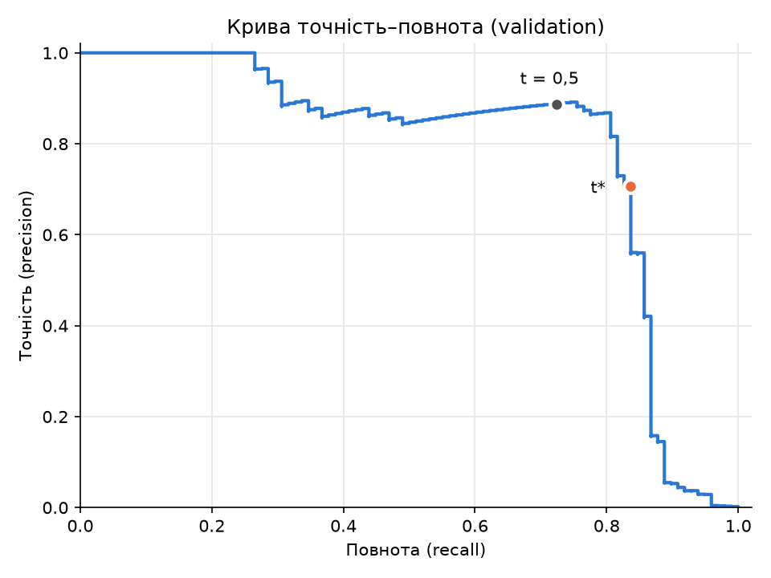
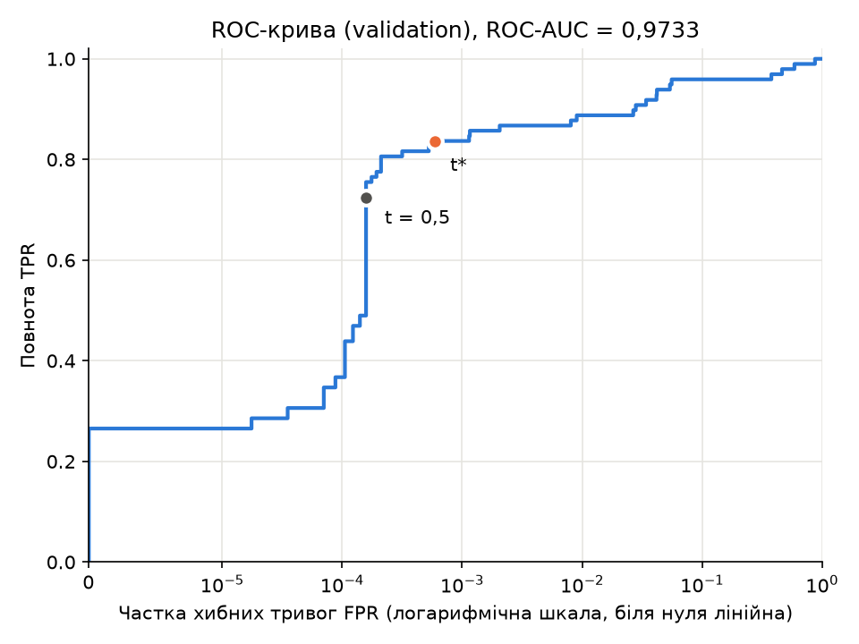

# Лабораторна робота №2

**на тему «Поріг рішення під асиметричну ціну помилок»**

з дисципліни «Системи глибинного навчання»

студентки групи КМ-31

Семеряги Софії

## Мета та зміст роботи

Метою роботи є вибір порога рішення бінарного класифікатора шахрайських
транзакцій за умови, що пропущене шахрайство коштує вдесятеро більше, ніж
хибна тривога. Модель навчається один раз і надалі не змінюється, змінюється
лише правило, за яким її оцінка перетворюється на рішення.

Поріг обирається на валідаційній вибірці за мінімумом вартості помилок.
Реалізацію пошуку перевірено незалежним перебором на трьох малих наборах,
після чого зафіксований поріг один раз застосовано до тестової вибірки.

## Відтворення

Використано набір [Credit Card Fraud Detection](https://www.kaggle.com/datasets/mlg-ulb/creditcardfraud)
(файл `creditcard.csv`, для завантаження потрібен обліковий запис Kaggle).
Файл даних до репозиторію не додано, шлях до локальної копії передається
параметром `--data`.

Команди виконуються з теки `lab2/`. Навчання з локального CSV:

```bash
uv run python lab2_starter.py --data creditcard.csv --out results_rerun
```

Аналіз зі збережених прогнозів без навчання:

```bash
uv run python main.py
```

Перша команда ділить дані, навчає модель і зберігає ваги, індекси поділу
та прогнози. Тека `results/` у репозиторії вже містить запуск, за яким
складено звіт, а стартовий код не записує результати в непорожню теку,
тому повторне навчання виконується в окрему теку. Її можна проаналізувати
командою `uv run python main.py --saved results_rerun --out analysis_rerun`.

Друга команда працює лише з прогнозами з `results/`, без вихідного CSV
і без навчання, виконує пункти 2–4 умови й записує результати в теку
`analysis/`.

Версії залежностей зафіксовані у `pyproject.toml` та `uv.lock`, версія
Python обмежена гілкою 3.12.

## Структура проєкту

| Файл | Призначення |
|---|---|
| `lab2_starter.py` | Стартовий код без змін: завантаження даних, стратифікований поділ, стандартизація, навчання моделі та збереження прогнозів. |
| `metrics.py` | Обчислення матриці плутанини прямим застосуванням правила $s \ge t$, функції вартості, точності та повноти. |
| `threshold.py` | Побудова таблиці всіх порогів-кандидатів через сортування й кумулятивні суми, вибір порога з мінімальною вартістю та збереження таблиці кандидатів і зафіксованого порога. |
| `curves.py` | Побудова кривої точність–повнота та ROC-кривої на валідаційній вибірці й обчислення ROC-AUC. |
| `brute_check.py` | Незалежна перевірка пошуку порога повним перебором на трьох малих наборах. |
| `evaluate.py` | Застосування зафіксованого порога до тестової вибірки та виписування перших хибнопозитивних і хибнонегативних прикладів. |
| `main.py` | Послідовне виконання пунктів 1–4 зі збережених прогнозів та виведення результатів. |

| Тека | Вміст |
|---|---|
| `results/` | Ваги моделі `model.pt`, індекси поділу, мітки, Amount та оцінки `predictions.npz`, статистики стандартизації `preprocessing.npz`, параметри запуску `run.json`. |
| `analysis/` | Повна таблиця кандидатів `candidates_validation.csv`, зафіксований поріг `threshold.json`, дві криві, результати перевірки пошуку на трьох малих наборах `threshold_checks.csv`, тестові метрики `test_metrics.json` і таблиця розібраних помилок `test_errors.csv`. |

## 1. Дані, поділ і навчання

Набір містить 284 807 транзакцій, з яких 492 шахрайські. Як ознаки
використано $V_1, \dots, V_{28}$ та Amount. Стовпці Class і Time до входу
моделі не входять. Сире значення Amount збережено окремо для аналізу помилок.

Індекси рядків поділено на навчальну, валідаційну й тестову вибірки
у співвідношенні 60/20/20 зі стратифікацією за класом, зберігаючи початковий
порядок рядків CSV. Спочатку функцією `train_test_split` з параметрами
`test_size=0.4`, `stratify=Class`, `random_state=0` відокремлено навчальну
вибірку. Відкладені індекси поділено навпіл з `test_size=0.5`, `random_state=0`
і стратифікацією за їхніми мітками: перша частина утворює валідаційну
вибірку, друга тестову.

| Вибірка | Кількість об'єктів | Шахрайських | Частка шахрайських |
|---|---|---|---|
| train | 170 884 | 295 | 0,1726 % |
| validation | 56 961 | 98 | 0,1720 % |
| test | 56 962 | 99 | 0,1738 % |

Ознаки стандартизовано через `StandardScaler`, навчений лише на навчальній
вибірці (зі збережених статистик видно, що він бачив 170 884 об'єкти).
До валідаційної та тестової вибірок застосовано ті самі середні й стандартні
відхилення. Обчислювати ці статистики на всьому наборі не можна, оскільки
тоді в навчання потрапила б інформація з даних, які мають залишатися
невідомими моделі. Валідаційна й тестова оцінки втратили б незалежність
і стали б оптимістично зміщеними.

Модель `Linear(29,32) → ReLU → Linear(32,1)` навчено один раз на навчальній
вибірці: функція втрат `BCEWithLogitsLoss` без зважування класів,
оптимізатор Adam зі швидкістю навчання $10^{-3}$, 12 епох, пакет 1024,
обчислення на CPU у `float32`. Використано ваги після 12-ї епохи. Для
валідаційної та тестової вибірок збережено оцінки

$$s_i = \sigma(z_i) = \frac{1}{1 + e^{-z_i}},$$

де $z_i$ — вихідний логіт мережі.

## 2. Вибір порога на валідаційній вибірці

### Метрики та функція вартості

Для порога $t$ транзакція вважається шахрайською, якщо $s_i \ge t$.
За цим правилом кожен об'єкт потрапляє до однієї з чотирьох клітинок
матриці плутанини:

- $TP$, істинно позитивні: шахрайські транзакції, правильно позначені як шахрайські.
- $FP$, хибно позитивні (хибні тривоги): легітимні транзакції, помилково позначені як шахрайські.
- $TN$, істинно негативні: легітимні транзакції, правильно позначені як легітимні.
- $FN$, хибно негативні (пропуски): шахрайські транзакції, позначені як легітимні.

Вартість помилок, у яку сума транзакції Amount не входить:

$$C(t) = 10 \cdot FN(t) + FP(t)$$

Точність і повнота:

$$\text{precision} = \frac{TP}{TP + FP}, \qquad \text{recall} = \frac{TP}{TP + FN}$$

Для ROC-кривої використано частку істинно позитивних, яка збігається
з повнотою, та частку хибно позитивних:

$$TPR = \frac{TP}{TP + FN}, \qquad FPR = \frac{FP}{FP + TN}$$

Якщо знаменник дорівнює нулю, метрика не визначена. Точність не визначена,
коли модель не позначила шахрайською жодної транзакції ($t = +\infty$):
серед нуля позитивних рішень частку справжніх шахрайств обчислити неможливо. Повнота не
визначена, коли у вибірці немає жодного шахрайства. Підставляти в такому
разі нуль некоректно, оскільки нульова метрика означала б найгірший
результат, а не його відсутність.

### Криві та ROC-AUC





На обох кривих позначено робочі точки порогів $0{,}5$ та $t^*$. Вісь FPR
на ROC-кривій логарифмічна (біля нуля лінійна), оскільки обидві робочі
точки лежать при $FPR < 10^{-3}$ і на лінійній осі злилися б з віссю ординат.

ROC-AUC на валідаційній вибірці становить **0,973318**.

Висока ROC-AUC не гарантує ні малої вартості помилок, ні високої точності.
Ця величина узагальнює якість ранжування за всіма порогами: значення 1
відповідає ідеальному ранжуванню, 0,5 відповідає випадковому. Її можна
тлумачити як імовірність того, що випадкова шахрайська транзакція отримає
вищу оцінку, ніж випадкова легітимна (рівні оцінки враховуються з вагою 1/2).
Ні конкретний поріг, ні ціни помилок у ній не враховані.

Точність пов'язана з точкою ROC-кривої через частку позитивного класу $\pi$:

$$\text{precision} = \frac{\pi \cdot TPR}{\pi \cdot TPR + (1 - \pi) \cdot FPR}$$

На валідаційній вибірці $\pi = 98 / 56\,961 \approx 0{,}0017$, тобто
легітимних транзакцій у 580 разів більше, ніж шахрайських. За такого малого
$\pi$ навіть мала FPR дає багато хибних тривог порівняно з кількістю
виявлених шахрайств:

| Поріг | TPR | FPR | precision | FP | C |
|---|---|---|---|---|---|
| 0,5 | 0,7245 | 0,000158 | 0,8875 | 9 | 279 |
| $t^*$ | 0,8367 | 0,000598 | 0,7069 | 34 | 194 |
| найбільший поріг із TPR ≥ 0,9 | 0,9082 | 0,028015 | 0,0529 | 1593 | 1683 |

За тієї самої ROC-AUC вимога виявляти 90 % шахрайств дає FPR лише 2,8 %,
проте це 1593 хибні тривоги, точність 5 % і вартість, вища навіть за
стратегію «усі негативні» ($C = 980$). Модель застосовується з одним порогом,
і для нього мають вагу абсолютні кількості помилок, а не площа під кривою.

### Пошук порога

Вартість $C(t)$ є кусково-сталою: вона змінюється лише тоді, коли поріг
перетинає оцінку якоїсь транзакції. Тому кандидатами є всі унікальні оцінки
валідаційної вибірки та $+\infty$: поріг $+\infty$ відповідає рішенню
«усі негативні», найменша оцінка — рішенню «усі позитивні».

Пошук виконано так:

1. Оцінки відсортовано за спаданням разом із мітками.
2. Обчислено кумулятивні суми $TP_k = \sum_{j \le k} [y_{(j)} = 1]$ і
   $FP_k = \sum_{j \le k} [y_{(j)} = 0]$. Якщо наступна оцінка строго менша,
   поріг, що дорівнює $k$-й оцінці у відсортованому порядку, позначає
   шахрайськими рівно перші $k$ транзакцій.
3. Рівні оцінки отримують однаковий прогноз, тому з кожної групи рівних
   оцінок взято лише останню позицію. Проміжні позиції описували б ситуацію,
   у якій однакові оцінки розділено порогом, що неможливо.
4. Решту клітинок отримано відніманням: $FN = N_+ - TP$, $TN = N_- - FP$, де
   $N_+$ і $N_-$ — кількості шахрайських і легітимних транзакцій. Для $+\infty$
   додано рядок $TP = FP = 0$.
5. Серед порогів із мінімальною вартістю обрано найбільший.

Сортування потребує $O(n \log n)$ операцій, усі інші кроки — один прохід
за $O(n)$. Повторного проходу по вибірці для кожного порога немає.

Валідаційна вибірка містить 56 961 оцінку, з них 55 988 унікальних, тобто
рівні оцінки трапляються й на реальних даних. Разом із $+\infty$ отримано
55 989 кандидатів, повну таблицю збережено в `analysis/candidates_validation.csv`.
Мінімальна вартість $C = 194$ досягається лише на одному кандидаті

$$t^* = 0{,}0311939158$$

(значення без округлення збережено в `analysis/threshold.json`). Ті самі
рішення дає будь-який поріг між наступною нижчою оцінкою $0{,}0306462385$
і $t^*$, тому як оптимальний поріг мінімум не єдиний.

| Правило на validation | Поріг | TP | FP | FN | TN | C |
|---|---|---|---|---|---|---|
| Стандартний поріг | 0,5 | 71 | 9 | 27 | 56 854 | 279 |
| Мінімум вартості | 0,0311939158 | 82 | 34 | 16 | 56 829 | 194 |
| Усі негативні | $+\infty$ | 0 | 0 | 98 | 56 863 | 980 |

Якщо оцінка $s$ є правильною умовною ймовірністю шахрайства на цільовому
розподілі, ціни помилок сталі, а правильні рішення нічого не коштують,
оптимальний поріг має замкнену форму:

$$t_{\text{теор}} = \frac{c_{FP}}{c_{FP} + c_{FN}} = \frac{1}{1 + 10} = \frac{1}{11} \approx 0{,}091$$

Знайдений $t^*$ утричі нижчий за $1/11$, але за вартістю ці пороги майже
рівноцінні. На валідаційній вибірці поріг $1/11$ дає $C = 203$ проти 194
для $t^*$. Зниження порога від $1/11$ до $t^*$ додає три виявлені шахрайства,
що зменшує вартість на 30, і 21 хибну тривогу, що збільшує її на 21.
Отже, положення мінімуму визначають лише кілька транзакцій, і на іншій
вибірці він міг би зсунутися. Тому сама розбіжність з $1/11$ не доводить,
що оцінки моделі некалібровані.

## 3. Перевірка реалізації пошуку порога

Для кожного з трьох наборів список кандидатів побудовано окремо (унікальні
оцінки та $+\infty$), матрицю плутанини й вартість обчислено прямим
застосуванням правила $s_i \ge t$ до кожного кандидата, а поріг обрано
окремим циклом із явним правилом нічиєї. Результати швидкого алгоритму
для побудови перевірочного не використано.

**Набір A**: $s = [0{,}9;\ 0{,}7;\ 0{,}7;\ 0{,}4;\ 0{,}2;\ 0{,}1]$, $y = [0;\ 1;\ 0;\ 1;\ 0;\ 0]$

| Поріг | TP | FP | FN | TN | C |
|---|---|---|---|---|---|
| $+\infty$ | 0 | 0 | 2 | 4 | 20 |
| 0,9 | 0 | 1 | 2 | 3 | 21 |
| 0,7 | 1 | 2 | 1 | 2 | 12 |
| **0,4** | **2** | **2** | **0** | **2** | **2** |
| 0,2 | 2 | 3 | 0 | 1 | 3 |
| 0,1 | 2 | 4 | 0 | 0 | 4 |

**Набір B**: $s = [0{,}9;\ 0{,}6;\ 0{,}3]$, $y = [0;\ 0;\ 0]$

| Поріг | TP | FP | FN | TN | C |
|---|---|---|---|---|---|
| $+\infty$ | **0** | **0** | **0** | **3** | **0** |
| 0,9 | 0 | 1 | 0 | 2 | 1 |
| 0,6 | 0 | 2 | 0 | 1 | 2 |
| 0,3 | 0 | 3 | 0 | 0 | 3 |

**Набір C**: $s = [0{,}8;\ \underbrace{0{,}5;\ \dots;\ 0{,}5}_{11};\ 0{,}2]$, $y = [1;\ 1;\ \underbrace{0;\ \dots;\ 0}_{10};\ 0]$
(перша з одинадцяти оцінок 0,5 має мітку 1, решта десять мають мітку 0)

| Поріг | TP | FP | FN | TN | C |
|---|---|---|---|---|---|
| $+\infty$ | 0 | 0 | 2 | 11 | 20 |
| **0,8** | **1** | **0** | **1** | **11** | **10** |
| 0,5 | 2 | 10 | 0 | 1 | 10 |
| 0,2 | 2 | 11 | 0 | 0 | 11 |

| Набір | $t^*$ повного перебору | $t^*$ швидкого алгоритму | Таблиці збігаються |
|---|---|---|---|
| A | 0,4 | 0,4 | так |
| B | $+\infty$ | $+\infty$ | так |
| C | 0,8 | 0,8 | так |

Усі лічильники та вартості збіглися точно, обрані пороги однакові. Таблиці
перевірки збережено в `analysis/threshold_checks.csv`.

Набір A перевіряє обробку рівних оцінок. Дві транзакції з оцінкою $0{,}7$
мають різні мітки, і будь-який поріг або позначає шахрайськими обидві, або
жодну. Якби швидкий алгоритм брав кожну позицію кумулятивної суми, а не
кінець групи, у таблиці з'явився б неможливий рядок, наприклад
«$0{,}7$: $TP = 1$, $FP = 1$».

Набір B перевіряє випадок без позитивних міток. Будь-яке позитивне рішення
тут є хибною тривогою, тому оптимальним є $t^* = +\infty$ з $C = 0$.
Без кандидата $+\infty$ алгоритм обрав би $0{,}9$ з $C = 1$. Повнота
в цьому наборі не визначена.

Набір C перевіряє правило нічиєї. Поріг $0{,}8$ пропускає одне шахрайство
($C = 10 \cdot 1 + 0 = 10$), поріг $0{,}5$ виявляє обидва, але дає десять
хибних тривог ($C = 0 + 10 = 10$). За однакової вартості обрано більший
поріг $0{,}8$.

## 4. Тестова оцінка та аналіз помилок

Поріг $t^* = 0{,}0311939158$, зафіксований на валідаційній вибірці,
застосовано до тестової вибірки (56 962 транзакції, з них 99 шахрайських).

| | прогноз «шахрайство» | прогноз «легітимна» |
|---|---|---|
| справді шахрайство | $TP = 80$ | $FN = 19$ |
| справді легітимна | $FP = 43$ | $TN = 56\,820$ |

$$C = 10 \cdot 19 + 43 = 233$$

$$\text{precision} = \frac{80}{80 + 43} = 0{,}6504, \qquad \text{recall} = \frac{80}{80 + 19} = 0{,}8081$$

Обидва знаменники ненульові, тому обидві метрики визначені.

Поріг обрано лише на валідаційній вибірці, а до тестової застосовано один
раз. Якби поріг обирали за найменшою вартістю на тесті, тестова оцінка
залежала б від цього вибору, стала б оптимістично зміщеною, і жодної
незалежної оцінки якості не залишилося б.

Для порівняння ті самі три правила на тестовій вибірці (поріг не змінювався):

| Правило на test | Поріг | TP | FP | FN | TN | C |
|---|---|---|---|---|---|---|
| Стандартний поріг | 0,5 | 71 | 8 | 28 | 56 855 | 288 |
| Мінімум вартості | 0,0311939158 | 80 | 43 | 19 | 56 820 | 233 |
| Усі негативні | $+\infty$ | 0 | 0 | 99 | 56 863 | 990 |

Перші п'ять хибнопозитивних і перші п'ять хибнонегативних прикладів
за номером рядка CSV (нумерація від 0, без заголовка):

| Рядок CSV | Тип помилки | Мітка | Оцінка | $s - t^*$ | Amount |
|---|---|---|---|---|---|
| 460 | FP | 0 | 0,196159 | +0,164965 | 2,00 |
| 2961 | FP | 0 | 0,080961 | +0,049767 | 2,49 |
| 10783 | FP | 0 | 0,966327 | +0,935133 | 89,99 |
| 13405 | FP | 0 | 0,932032 | +0,900838 | 89,99 |
| 13617 | FP | 0 | 0,922762 | +0,891568 | 89,99 |
| 10497 | FN | 1 | 0,011464 | −0,019730 | 3,79 |
| 52521 | FN | 1 | 0,006373 | −0,024821 | 105,99 |
| 55401 | FN | 1 | 0,005642 | −0,025552 | 1,00 |
| 91671 | FN | 1 | 0,000500 | −0,030693 | 290,18 |
| 93486 | FN | 1 | 0,018352 | −0,012842 | 0,00 |

Відстані від порога для двох типів помилок напряму не порівнюються.
Оцінка хибнонегативного прикладу лежить між 0 і $t^*$, тому її відстань
від порога за модулем не перевищує $t^* \approx 0{,}031$. Для наведених FN
оцінки становлять від 0,0005 до 0,018, тобто приблизно в 1,7–62 рази менші
за поріг. Модель дала цим шахрайствам низькі оцінки, і виявити їх можна було б
лише значно нижчим порогом ціною нових хибних тривог. Хибнопозитивні
приклади неоднорідні. Два з них мають оцінки 0,08 і 0,20, а три отримали
оцінки 0,92–0,97, близькі до максимальних. Ці три
транзакції мають однакову суму 89,99, що може вказувати на схожі операції,
але перевірити це за таблицею неможливо.

Сирі суми не відрізняють два типи помилок: серед наведених прикладів Amount
коливається від 0 до 290 для FN і від 2 до 90 для FP. За десятьма прикладами судити про причину
помилок моделі не можна. Це не випадкова вибірка, а перші за номером рядка
приклади, лише 10 із 62 помилок, і без порівняння з правильно класифікованими
транзакціями будь-яка помічена закономірність залишається гіпотезою.

## Висновки

У ході виконання лабораторної роботи №2 навчено модель
`Linear(29,32) → ReLU → Linear(32,1)` для виявлення шахрайських транзакцій,
реалізовано обчислення матриці плутанини та вартості помилок
$C = 10 \cdot FN + FP$, побудовано криву точність–повнота та ROC-криву
на валідаційній вибірці, реалізовано пошук порога за мінімумом вартості
через сортування й кумулятивні суми за $O(n \log n)$ та перевірено його
незалежним перебором на трьох малих наборах. Обраний поріг
$t^* = 0{,}0311939158$ застосовано до тестової вибірки, де вартість
помилок становить 233 проти 288 для стандартного порога $0{,}5$.

За результатами роботи можна зробити такі висновки.

Вибір порога змінив лише правило прийняття рішення, а не саму модель:
ваги й оцінки залишилися тими самими. Зниження порога з $0{,}5$ до $t^*$
перевело частину транзакцій із прогнозу «легітимна» в прогноз «шахрайство»
і знизило вартість помилок з 279 до 194 на валідаційній вибірці та з 288
до 233 на тестовій.

Ціною цього рішення стали додаткові хибні тривоги. На валідаційній вибірці
кількість $FN$ зменшилася з 27 до 16, а $FP$ зросла з 9 до 34, на тестовій
$FN$ зменшилася з 28 до 19, а $FP$ зросла з 8 до 43. Точність на тестовій
вибірці впала з 0,8987 до 0,6504. Такий обмін вигідний лише тому, що пропуск
шахрайства вдесятеро дорожчий: кожне виявлене шахрайство окуповує до десяти
хибних тривог. За однакових цін помилок той самий зсув порога був би
невигідним.

Результат на валідаційній вибірці не гарантує такого самого виграшу на
тестовій. Поріг обрано як мінімум серед 55 989 кандидатів саме на цих даних,
тому валідаційна вартість є оптимістично зміщеною оцінкою. Позитивних
прикладів лише 98, і кожен із них змінює вартість на 10, тож кілька
шахрайств по різні боки порога суттєво зсувають мінімум. На тестовій
вибірці між порогами $0{,}5$ і $t^*$ потрапило 9 шахрайств замість 11 і 35
легітимних транзакцій замість 25, тому виграш у вартості становив 55 замість
85. Поріг усе ж залишився вигідним, проте величина виграшу на нових даних
виявилася меншою.
